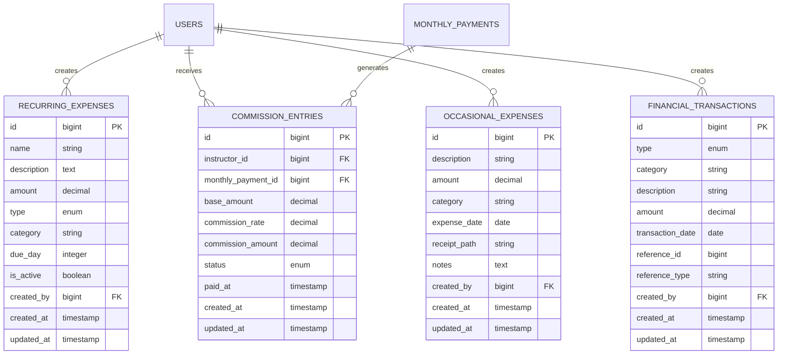

# Design Document - Módulo de Gestão Financeira

## Overview

O módulo de Gestão Financeira será integrado ao sistema existente de gerenciamento do Studio, aproveitando a arquitetura Laravel + Inertia.js já estabelecida. O módulo centralizará todas as operações financeiras, incluindo contas recorrentes, comissões automáticas e lançamentos ocasionais, fornecendo relatórios consolidados para tomada de decisão.

## Architecture

### Estrutura de Dados

O módulo será composto por quatro modelos principais que se integram com o sistema existente:



### Integração com Sistema Existente

O módulo se integrará com:
- **MonthlyPayment**: Para cálculo automático de comissões
- **User**: Para associar comissões aos instrutores
- **Sistema de autenticação**: Para controle de acesso e auditoria

## Components and Interfaces

### Backend Components

#### 1. Models

**RecurringExpense**
- Gerencia contas recorrentes (aluguel, água, energia)
- Suporte a valores fixos e variáveis
- Controle de vencimento e status

**CommissionEntry**
- Registra comissões calculadas automaticamente
- Vincula com pagamentos confirmados
- Controle de status (pendente/pago)

**OccasionalExpense**
- Lançamentos de gastos não previstos
- Suporte a anexos de comprovantes
- Categorização flexível

**FinancialTransaction**
- Registro unificado de todas as transações
- Suporte a diferentes tipos e origens
- Base para relatórios consolidados

#### 2. Services

**FinancialService**
- Orquestra operações financeiras
- Gera relatórios consolidados
- Calcula indicadores financeiros

**CommissionService**
- Calcula comissões automaticamente
- Integra com PaymentService existente
- Processa pagamentos de comissões

**ExpenseService**
- Gerencia contas recorrentes e ocasionais
- Controla vencimentos e notificações
- Processa uploads de comprovantes

#### 3. Controllers

**FinancialController**
- Dashboard financeiro
- Relatórios consolidados
- Exportação de dados

**RecurringExpenseController**
- CRUD de contas recorrentes
- Processamento de vencimentos
- Histórico de pagamentos

**CommissionController**
- Visualização de comissões
- Processamento de pagamentos
- Relatórios por instrutor

**OccasionalExpenseController**
- CRUD de lançamentos ocasionais
- Upload de comprovantes
- Categorização e filtros

### Frontend Components

#### 1. Pages

**Financial/Dashboard**
- Visão geral financeira
- Gráficos de receitas vs despesas
- Indicadores principais

**Financial/RecurringExpenses**
- Lista e gerenciamento de contas recorrentes
- Calendário de vencimentos
- Histórico de pagamentos

**Financial/Commissions**
- Lista de comissões por instrutor
- Processamento de pagamentos
- Relatórios detalhados

**Financial/OccasionalExpenses**
- Lista e cadastro de gastos ocasionais
- Upload de comprovantes
- Filtros por categoria e período

**Financial/Reports**
- Relatórios consolidados
- Gráficos e análises
- Exportação de dados

#### 2. Components

**ExpenseCard**
- Exibição de despesas individuais
- Ações rápidas (pagar, editar)
- Status visual

**CommissionTable**
- Tabela de comissões por instrutor
- Filtros e ordenação
- Ações em lote

**FinancialChart**
- Gráficos de evolução financeira
- Comparativos por período
- Indicadores visuais

**ReportExporter**
- Interface de exportação
- Seleção de formatos
- Configuração de filtros

## Data Models

### RecurringExpense
```php
{
    id: bigint,
    name: string,           // "Aluguel", "Conta de Luz"
    description: text,      // Descrição detalhada
    amount: decimal,        // Valor (null para variáveis)
    type: enum,            // 'fixed', 'variable'
    category: string,       // "Utilidades", "Aluguel"
    due_day: integer,       // Dia do vencimento (1-31)
    is_active: boolean,
    created_by: bigint,
    created_at: timestamp,
    updated_at: timestamp
}
```

### CommissionEntry
```php
{
    id: bigint,
    instructor_id: bigint,
    monthly_payment_id: bigint,
    base_amount: decimal,        // Valor base do pagamento
    commission_rate: decimal,    // Taxa aplicada
    commission_amount: decimal,  // Valor da comissão
    status: enum,               // 'pending', 'paid'
    paid_at: timestamp,
    created_at: timestamp,
    updated_at: timestamp
}
```

### OccasionalExpense
```php
{
    id: bigint,
    description: string,
    amount: decimal,
    category: string,      // "Material", "Equipamento", "Limpeza"
    expense_date: date,
    receipt_path: string,  // Caminho do comprovante
    notes: text,
    created_by: bigint,
    created_at: timestamp,
    updated_at: timestamp
}
```

### FinancialTransaction
```php
{
    id: bigint,
    type: enum,           // 'income', 'expense', 'commission'
    category: string,
    description: string,
    amount: decimal,
    transaction_date: date,
    reference_id: bigint,    // ID da origem (payment, expense, etc)
    reference_type: string,  // Tipo da origem
    created_by: bigint,
    created_at: timestamp,
    updated_at: timestamp
}
```

## Error Handling

### Validation Rules
- Valores monetários devem ser positivos
- Datas não podem ser futuras (exceto vencimentos)
- Taxas de comissão entre 0-100%
- Categorias devem ser pré-definidas
- Uploads limitados a tipos específicos

### Exception Handling
- **CommissionCalculationException**: Erros no cálculo de comissões
- **FileUploadException**: Problemas com upload de comprovantes
- **IntegrationException**: Falhas na integração com outros módulos
- **ReportGenerationException**: Erros na geração de relatórios

### Error Recovery
- Retry automático para cálculos de comissão
- Backup de arquivos antes de operações críticas
- Log detalhado para auditoria
- Notificações para administradores

## Testing Strategy

### Unit Tests
- Models: Validações e relacionamentos
- Services: Lógica de negócio e cálculos
- Controllers: Respostas e validações

### Integration Tests
- Integração com sistema de pagamentos
- Cálculo automático de comissões
- Geração de relatórios
- Upload de arquivos

### Feature Tests
- Fluxos completos de usuário
- Permissões e autorizações
- Exportação de dados
- Notificações

### Performance Tests
- Geração de relatórios com grandes volumes
- Cálculos em lote de comissões
- Consultas complexas de dashboard

## Security Considerations

### Access Control
- Apenas administradores podem gerenciar despesas
- Instrutores visualizam apenas suas comissões
- Auditoria completa de todas as operações

### Data Protection
- Criptografia de dados sensíveis
- Backup automático de comprovantes
- Retenção controlada de dados históricos

### File Security
- Validação rigorosa de uploads
- Armazenamento seguro de comprovantes
- Controle de acesso a arquivos

## Integration Points

### PaymentService Integration
```php
// Hook no PaymentService para cálculo automático
public function processPayment(MonthlyPayment $payment, ...)
{
    // Lógica existente...
    
    // Nova integração
    if ($payment->status === 'paid') {
        app(CommissionService::class)->calculateCommission($payment);
        app(FinancialService::class)->recordTransaction($payment);
    }
}
```

### Notification Integration
- Notificações de vencimento de contas
- Alertas de comissões pendentes
- Relatórios automáticos por email

### Dashboard Integration
- Widgets financeiros no dashboard principal
- Indicadores de performance
- Alertas visuais para ações necessárias